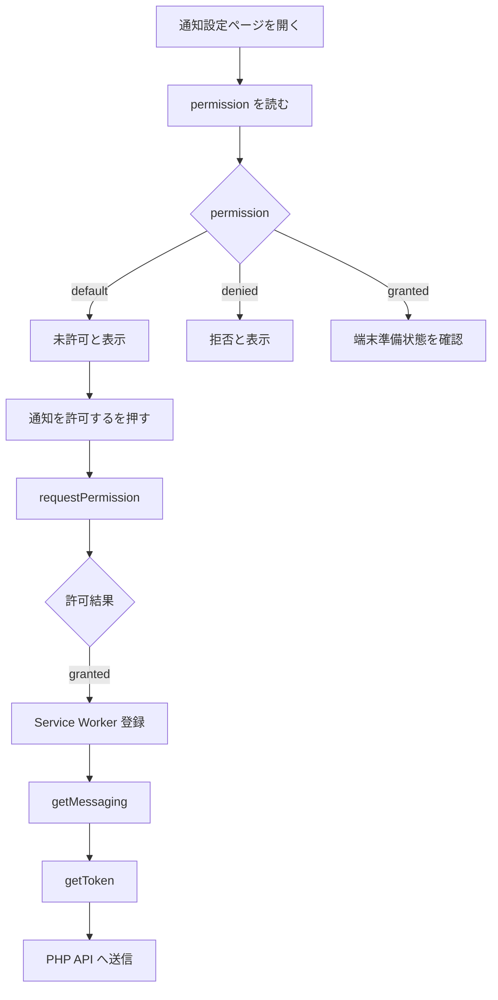

# 02. PWA クライアント実装

## 1. 使用技術

- React 19
- Vite 8
- JavaScript / JSX
- Firebase Web SDK
- Service Worker
- HTTPS
- PHP セッション認証 API

Vite の設定には次が存在します。

```javascript
base: '/TABI/',
```

この設定は Service Worker のスコープに関係します。

## 2. Firebase パッケージの追加

```bash
npm install firebase
npm run build
```

依存パッケージ追加直後にビルド確認すると、その後の実装エラーと切り分けやすくなります。

## 3. `.env.local`

プロジェクト直下に作成しました。

```text
TABI/
├─ .env.local
├─ package.json
├─ vite.config.js
└─ src/
```

内容:

```env
VITE_FIREBASE_API_KEY=
VITE_FIREBASE_AUTH_DOMAIN=
VITE_FIREBASE_PROJECT_ID=
VITE_FIREBASE_STORAGE_BUCKET=
VITE_FIREBASE_MESSAGING_SENDER_ID=
VITE_FIREBASE_APP_ID=
VITE_FIREBASE_VAPID_KEY=
```

### `.gitignore`

```gitignore
*.local

.env
.env.*
!.env.example
```

### Vite の重要な仕様

`VITE_` で始まる環境変数は、ビルド後にクライアント側へ公開されます。

次を入れてはいけません。

```env
VITE_DB_PASSWORD=
VITE_FIREBASE_PRIVATE_KEY=
VITE_SERVICE_ACCOUNT_JSON=
```

## 4. Firebase 初期化

ファイル:

```text
src/firebase/firebaseConfig.js
```

確認済みの実装:

```javascript
import { getApp, getApps, initializeApp } from 'firebase/app';

// Firebaseの設定値は環境変数から読み込みます。
// 環境ごとに設定を分け、設定値をソースコードへ直接書かないようにします。
const firebaseEnv = {
  VITE_FIREBASE_API_KEY: import.meta.env.VITE_FIREBASE_API_KEY,
  VITE_FIREBASE_AUTH_DOMAIN: import.meta.env.VITE_FIREBASE_AUTH_DOMAIN,
  VITE_FIREBASE_PROJECT_ID: import.meta.env.VITE_FIREBASE_PROJECT_ID,
  VITE_FIREBASE_STORAGE_BUCKET: import.meta.env.VITE_FIREBASE_STORAGE_BUCKET,
  VITE_FIREBASE_MESSAGING_SENDER_ID:
    import.meta.env.VITE_FIREBASE_MESSAGING_SENDER_ID,
  VITE_FIREBASE_APP_ID: import.meta.env.VITE_FIREBASE_APP_ID,
};

const missingEnvName = Object.entries(firebaseEnv).find(
  ([, value]) => typeof value !== 'string' || value.trim() === ''
)?.[0];

if (missingEnvName) {
  throw new Error(
    `Firebaseの環境変数 ${missingEnvName} が設定されていません。`
  );
}

const firebaseConfig = {
  apiKey: firebaseEnv.VITE_FIREBASE_API_KEY,
  authDomain: firebaseEnv.VITE_FIREBASE_AUTH_DOMAIN,
  projectId: firebaseEnv.VITE_FIREBASE_PROJECT_ID,
  storageBucket: firebaseEnv.VITE_FIREBASE_STORAGE_BUCKET,
  messagingSenderId: firebaseEnv.VITE_FIREBASE_MESSAGING_SENDER_ID,
  appId: firebaseEnv.VITE_FIREBASE_APP_ID,
};

// Reactの開発中は同じコードが読み直されることがあります。
// すでにFirebaseアプリがある場合は再初期化せず、重複初期化エラーを防ぎます。
const firebaseApp =
  getApps().length === 0
    ? initializeApp(firebaseConfig)
    : getApp();

export { firebaseApp };
```

### なぜ `getApps()` を確認するのか

Vite の Hot Module Replacement や React の開発中には、同じモジュールが再評価されることがあります。

同じ Firebase アプリを再度初期化しないためです。

## 5. Messaging 対応確認

ファイル:

```text
src/firebase/firebaseMessaging.js
```

確認済みの実装:

```javascript
import { getMessaging, isSupported } from 'firebase/messaging';
import { firebaseApp } from './firebaseConfig';

async function getFirebaseMessaging() {
  // Firebase Messagingはブラウザの機能を使うため、ブラウザ以外では動かしません。
  if (
    typeof window === 'undefined' ||
    typeof navigator === 'undefined'
  ) {
    return null;
  }

  try {
    // ブラウザや端末によってはMessagingに対応していないため、先に安全に確認します。
    const supported = await isSupported();

    if (!supported) {
      // 未対応は異常ではないので、画面を止めずに呼び出し元で判定できるnullを返します。
      return null;
    }

    return getMessaging(firebaseApp);
  } catch {
    // 確認中に失敗しても、通知以外の画面まで止めないようにnullを返します。
    return null;
  }
}

export { getFirebaseMessaging };
```

通知非対応だけを理由に、ログインや旅行計画などの画面全体を壊さないため、未対応時は `null` を返します。

## 6. Service Worker

主なファイル:

```text
src/firebase/firebase-messaging-sw.js
src/firebase/registerFirebaseServiceWorker.js
```

### なぜ必要か

Service Worker は、通常の React 画面とは別にブラウザが管理するバックグラウンド処理です。

ページが別タブに隠れているときや、フォーカスが外れているときの Push 受信に使われます。

### なぜ `src` 側でビルドしたか

Firebase の modular SDK を Worker 内で使うため、Vite でバンドルする設計にしました。

`public` 配下のファイルでは Vite の `import.meta.env` 変換をそのまま使えません。

### `/TABI/` スコープ

```javascript
navigator.serviceWorker.register(workerUrl, {
  scope: import.meta.env.BASE_URL,
});
```

`BASE_URL` は `base: '/TABI/'` を反映します。

### 開発サーバーで登録しない理由

開発環境では Worker の URL、キャッシュ、更新タイミングが本番と異なり、古い Worker が残るとデバッグが難しくなります。

確認は主に次で行います。

```bash
npm run build
npm run preview
```

## 7. 通知許可と FCM トークン取得

通知許可はページ表示時に自動で出しません。

ユーザーがボタンを押したときだけ実行します。



### なぜユーザー操作を起点にするか

- 目的を理解する前に拒否されるのを防ぐ
- 一度 `denied` になると、Web アプリ側から繰り返しダイアログを出せない
- 不審なサイトに見えるのを防ぐ

### `getToken()` へ渡す値

```javascript
getToken(messaging, {
  vapidKey,
  serviceWorkerRegistration,
});
```

## 8. 通知設定画面の UI

### 未許可時

- 案内: この端末では通知がまだ許可されていません
- スイッチ: 全て OFF 表示
- スイッチ: 編集不可
- DB の通知設定: 変更しない

### 許可・端末登録完了後

- 案内: この端末では通知を受け取る準備ができています
- DB から取得した設定を表示
- スイッチを編集可能にする

表示例:

```javascript
const displayedSettings = canEditNotificationSettings
  ? savedSettings
  : {
      chatNotification: false,
      surveyDeadlineNotification: false,
      scheduleReminderNotification: false,
      memberJoinNotification: false,
      splitBillNotification: false,
    };
```

未許可時の `false` は表示専用です。更新 API へ送ってはいけません。

## 9. フォアグラウンドとバックグラウンド

- バックグラウンド: Service Worker が受信
- フォアグラウンド: ページ側の `onMessage()` が受信

現在は `onMessage()` とアプリ内トーストが未実装です。そのため、TABI を前面で開いていると画面へ何も出ないことがあります。

## 10. 公式資料

- Vite 環境変数  
  https://vite.dev/guide/env-and-mode
- Web FCM の開始  
  https://firebase.google.com/docs/cloud-messaging/web/get-started
- Web メッセージ受信  
  https://firebase.google.com/docs/cloud-messaging/web/receive-messages
- `getToken` オプション  
  https://firebase.google.com/docs/reference/js/messaging_.gettokenoptions
