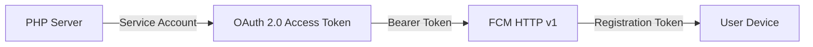

# 08. 実装状況と次の作業

## 1. 完了済み

### Firebase

- [x] Firebase プロジェクト作成
- [x] Web アプリ登録
- [x] Cloud Messaging API v1 の確認
- [x] VAPID キーペア生成
- [x] サービスアカウント JSON 生成
- [x] 秘密鍵をリポジトリ外へ保管

### フロントエンド

- [x] `firebase` パッケージ導入
- [x] `.env.local`
- [x] Firebase 初期化
- [x] 重複初期化防止
- [x] Messaging 対応確認
- [x] Service Worker
- [x] `/TABI/` スコープ
- [x] 通知許可画面
- [x] ユーザー操作時のみ許可要求
- [x] FCM トークン取得
- [x] 通知設定画面
- [x] 未許可時 OFF・編集不可
- [x] 許可後に保存設定を表示

### DB

- [x] `notification_settings`
- [x] `user_devices` 拡張
- [x] `token_hash`
- [x] UNIQUE 制約
- [x] `platform` / `app_type`
- [x] `is_active`
- [x] 外部キー
- [x] 既存ダミートークン無効化
- [x] AWS RDS 反映
- [x] 整合性確認

### API

- [x] FCM 端末登録
- [x] ログインユーザーとの関連付け
- [x] 通知設定取得
- [x] 通知設定更新
- [x] DB 保存後の UI 反映

### テスト

- [x] 通知許可
- [x] DB 端末登録
- [x] Firebase Console からテスト送信
- [x] Windows 通知センターで受信

## 2. 次に実装する機能

### 優先1: アプリ内通知履歴

新しいテーブル例:

```text
notifications
notification_recipients
```

必要項目例:

```text
notifications:
notification_id
type
title
body
action_url
created_at

notification_recipients:
notification_id
user_id
is_read
read_at
delivered_at
created_at
```

### なぜ FCM より先に通知履歴を作るのか

FCM は配信経路です。

アプリ内で次を実現するには DB の通知履歴が必要です。

- 右上ベル
- 過去の通知
- 未読件数
- 既読管理
- 通知を押して該当画面へ移動
- 端末がオフラインでも後から確認
- FCM 送信に失敗してもアプリ内履歴を残す

## 3. 優先2: 右上ベルと通知一覧

必要:

- 通知一覧ページ
- 未読件数 API
- 既読 API
- 一括既読
- ページング
- 通知タイプ別アイコン
- `action_url`
- 安全な内部ルート検証

## 4. 優先3: PHP から FCM HTTP v1 送信



必要:

- サービスアカウント JSON の安全な配置
- Google Auth ライブラリまたは JWT/OAuth 実装
- 短時間アクセストークン
- FCM API 呼び出し
- 送信結果処理
- 無効トークンの停止
- ログにトークンを書かない

## 5. 優先4: イベントへ接続

候補:

- チャット受信
- アンケート締切
- 予定リマインド
- メンバー参加
- 割り勘更新

```text
業務処理成功
  ↓
通知履歴作成
  ↓
対象ユーザーの通知設定確認
  ↓
有効端末取得
  ↓
FCM 送信
  ↓
送信結果記録
```

通知送信に失敗しても、本体の業務処理を必要以上に失敗扱いにしない設計が必要です。

## 6. 優先5: フォアグラウンド受信

`onMessage()` を追加します。

表示候補:

- Sonner のトースト
- 右上ベルの未読件数を更新
- 通知一覧へ即時追加
- チャット画面を開いている場合は通知を抑制

## 7. 優先6: 通知クリック

Service Worker で通知クリックを処理します。

必要:

- `notificationclick`
- `action_url`
- 既存タブを前面へ
- 未起動なら開く
- 外部 URL を無制限に開かない
- `/TABI/` 内部 URL だけ許可する

## 8. 完了条件

- [ ] アプリ内通知履歴が残る
- [ ] ベルに未読件数が出る
- [ ] 一覧と既読が動く
- [ ] PHP からテスト送信できる
- [ ] チャットイベントから自動送信できる
- [ ] 通知設定 OFF を尊重する
- [ ] 無効端末へ送り続けない
- [ ] フォアグラウンドで表示できる
- [ ] 通知クリックで安全に遷移できる
- [ ] PWA で再テスト
- [ ] Android でテスト
- [ ] iOS でテスト

## 9. 推奨コミット単位

```text
feat: アプリ内通知履歴のDB構成を追加
feat: 通知一覧と未読管理を追加
feat: FCM HTTP v1送信処理を追加
feat: チャット受信時のプッシュ通知を追加
feat: フォアグラウンド通知表示を追加
fix: 無効なFCMトークンを送信対象外にする
```

## 10. 公式資料

- FCM HTTP v1  
  https://firebase.google.com/docs/cloud-messaging/send/v1-api
- サーバー環境  
  https://firebase.google.com/docs/cloud-messaging/server-environment
- メッセージ種別  
  https://firebase.google.com/docs/cloud-messaging/customize-messages/set-message-type
