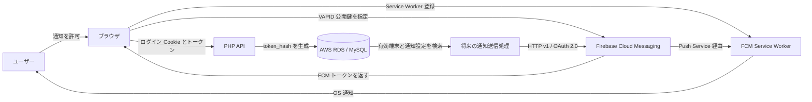

# TABI Firebase Cloud Messaging 導入ドキュメント

- 作成日: 2026-07-22
- 対象: TABI PWA、PHP バックエンド、MySQL/AWS RDS
- 将来対象: Capacitor による Android・iOS ネイティブアプリ
- 想定読者: TABI の開発チーム、コード初心者、運用担当者

## 1. このドキュメントの目的

TABI にプッシュ通知を導入するために行った作業を、単なる操作手順ではなく、次の観点を含めて共有するための資料です。

- 何を設定したか
- なぜその設定が必要なのか
- ブラウザ、Firebase、PHP、DB がどのようにつながるか
- 実際にどこまで動作確認できたか
- セキュリティ上、何を公開してよく、何を絶対に公開してはいけないか
- PWA と将来の Android・iOS ネイティブアプリをどう共通設計するか
- 次に何を実装すべきか

## 2. 現在の到達点

2026-07-22 時点で、次の流れをブラウザ環境で確認済みです。

```text
ユーザーが通知を許可
  ↓
Service Worker を登録
  ↓
Firebase Messaging が FCM トークンを取得
  ↓
PHP API がログインユーザーと端末を関連付ける
  ↓
AWS RDS の user_devices に保存
  ↓
Firebase Console からテスト通知を送信
  ↓
Windows の通知センターで受信
```

確認済みの主な項目:

- Firebase プロジェクト作成
- Firebase Web アプリ登録
- Web Push 証明書の VAPID キーペア作成
- Firebase Admin SDK 用サービスアカウント JSON の生成
- Firebase Web SDK の導入
- Firebase 初期化処理
- Messaging 対応可否の確認
- Messaging 用 Service Worker の準備と登録
- ユーザー操作を起点とした通知許可
- FCM トークン取得
- `user_devices` への端末登録
- `notification_settings` による通知種別設定
- 未許可時の UI 制御
- Firebase Console からのテスト通知受信

## 3. まだ実装していないもの

- PHP サーバーから FCM HTTP v1 API を使って自動送信する処理
- チャット投稿、メンバー参加、予定などを起点とした自動通知
- TABI アプリ内の通知履歴
- 右上ベルの未読件数
- 通知一覧ページと既読管理
- フォアグラウンド時の `onMessage()` 表示
- 無効になった FCM トークンの自動停止・削除
- Android ネイティブ通知
- iOS ネイティブ通知
- Capacitor Push Notifications 連携

Firebase Console からのテスト通知が届いたことは、クライアント受信経路が動作することの確認です。TABI の業務処理から自動的に通知する機能が完成したことを意味するわけではありません。

## 4. 全体構成



## 5. 重要な設計判断

### 5.1 通知権限と通知設定を分離する

- `Notification.permission`
  - 現在使用中のブラウザ・端末ごとの状態
  - `default`、`granted`、`denied`
  - ブラウザから毎回確認する
- `notification_settings`
  - ユーザーが受け取りたい通知の種類
  - ユーザー単位で DB に保存する
- `user_devices`
  - 通知を届けられる端末と FCM トークン
  - 1 ユーザーが複数端末を持てる

### 5.2 未許可時は画面上だけスイッチを OFF にする

現在の端末が通知未許可の場合:

- 画面上: 全スイッチを OFF 表示
- 操作: 編集不可
- DB: 保存済みのユーザー設定を変更しない

同じユーザーが別端末では通知を許可している可能性があるため、現在端末の権限だけを理由にユーザー全体の設定を消してはいけません。

### 5.3 PWA とネイティブで端末テーブルを共通化する

```text
PWA:
platform = web
app_type = pwa

Android:
platform = android
app_type = native

iOS:
platform = ios
app_type = native
```

## 6. ドキュメント一覧

| ファイル | 内容 |
|---|---|
| `01_Firebaseコンソール設定.md` | Firebase 登録、Web アプリ、VAPID、サービスアカウント |
| `02_PWAクライアント実装.md` | Vite、環境変数、初期化、Service Worker、許可、トークン取得 |
| `03_DBとPHP_API設計.md` | テーブル設計、トークン保存、通知設定 API |
| `04_AWS_RDSマイグレーション手順.md` | RDS 変更前確認、実行手順、検証、注意点 |
| `05_動作確認手順.md` | 通知許可、DB 登録、Firebase Console テスト |
| `06_セキュリティと運用.md` | 秘密情報、Git、API、トークン、運用ルール |
| `07_Capacitorネイティブ化ロードマップ.md` | Android・iOS 追加時の設計 |
| `08_実装状況と次の作業.md` | 完了項目、未完了項目、推奨順序 |
| `09_トラブルシューティングと用語集.md` | よくある問題と初心者向け用語 |
| `TABI_FCM_導入手順_完全版.md` | 上記を1ファイルに統合した共有用資料 |

## 7. 公式資料

- Firebase Web FCM 導入  
  https://firebase.google.com/docs/cloud-messaging/web/get-started
- Firebase Web メッセージ受信  
  https://firebase.google.com/docs/cloud-messaging/web/receive-messages
- Firebase Console からの送信  
  https://firebase.google.com/docs/cloud-messaging/send/firebase-console
- Vite 環境変数  
  https://vite.dev/guide/env-and-mode
- Firebase API キーの扱い  
  https://firebase.google.com/docs/projects/api-keys
