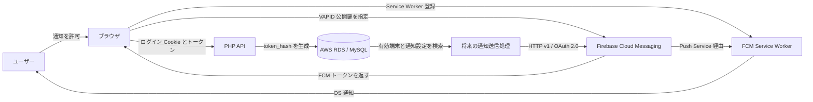
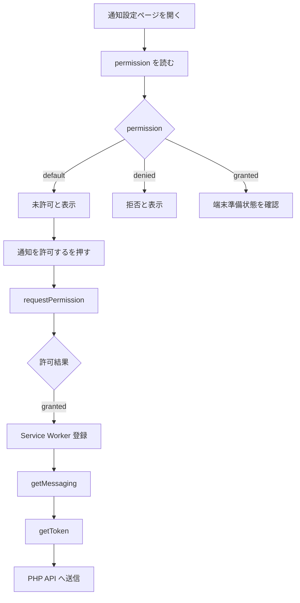
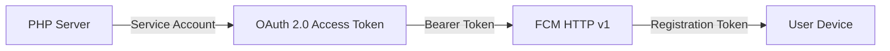

# TABI Firebase Cloud Messaging 導入手順 完全版

> 分割ドキュメントをチーム共有用に1つへ統合したものです。秘密情報やFCMトークンの実値は含めていません。


---

# TABI Firebase Cloud Messaging 導入ドキュメント

- 作成日: 2026-07-22
- 対象: TABI PWA、PHP バックエンド、MySQL/AWS RDS
- 将来対象: Capacitor による Android・iOS ネイティブアプリ
- 想定読者: TABI の開発チーム、コード初心者、運用担当者

## 1. このドキュメントの目的

TABI にプッシュ通知を導入するために行った作業を、単なる操作手順ではなく、次の観点を含めて共有するための資料です。

- 何を設定したか
- なぜその設定が必要なのか
- ブラウザ、Firebase、PHP、DB がどのようにつながるか
- 実際にどこまで動作確認できたか
- セキュリティ上、何を公開してよく、何を絶対に公開してはいけないか
- PWA と将来の Android・iOS ネイティブアプリをどう共通設計するか
- 次に何を実装すべきか

## 2. 現在の到達点

2026-07-22 時点で、次の流れをブラウザ環境で確認済みです。

```text
ユーザーが通知を許可
  ↓
Service Worker を登録
  ↓
Firebase Messaging が FCM トークンを取得
  ↓
PHP API がログインユーザーと端末を関連付ける
  ↓
AWS RDS の user_devices に保存
  ↓
Firebase Console からテスト通知を送信
  ↓
Windows の通知センターで受信
```

確認済みの主な項目:

- Firebase プロジェクト作成
- Firebase Web アプリ登録
- Web Push 証明書の VAPID キーペア作成
- Firebase Admin SDK 用サービスアカウント JSON の生成
- Firebase Web SDK の導入
- Firebase 初期化処理
- Messaging 対応可否の確認
- Messaging 用 Service Worker の準備と登録
- ユーザー操作を起点とした通知許可
- FCM トークン取得
- `user_devices` への端末登録
- `notification_settings` による通知種別設定
- 未許可時の UI 制御
- Firebase Console からのテスト通知受信

## 3. まだ実装していないもの

- PHP サーバーから FCM HTTP v1 API を使って自動送信する処理
- チャット投稿、メンバー参加、予定などを起点とした自動通知
- TABI アプリ内の通知履歴
- 右上ベルの未読件数
- 通知一覧ページと既読管理
- フォアグラウンド時の `onMessage()` 表示
- 無効になった FCM トークンの自動停止・削除
- Android ネイティブ通知
- iOS ネイティブ通知
- Capacitor Push Notifications 連携

Firebase Console からのテスト通知が届いたことは、クライアント受信経路が動作することの確認です。TABI の業務処理から自動的に通知する機能が完成したことを意味するわけではありません。

## 4. 全体構成



## 5. 重要な設計判断

### 5.1 通知権限と通知設定を分離する

- `Notification.permission`
  - 現在使用中のブラウザ・端末ごとの状態
  - `default`、`granted`、`denied`
  - ブラウザから毎回確認する
- `notification_settings`
  - ユーザーが受け取りたい通知の種類
  - ユーザー単位で DB に保存する
- `user_devices`
  - 通知を届けられる端末と FCM トークン
  - 1 ユーザーが複数端末を持てる

### 5.2 未許可時は画面上だけスイッチを OFF にする

現在の端末が通知未許可の場合:

- 画面上: 全スイッチを OFF 表示
- 操作: 編集不可
- DB: 保存済みのユーザー設定を変更しない

同じユーザーが別端末では通知を許可している可能性があるため、現在端末の権限だけを理由にユーザー全体の設定を消してはいけません。

### 5.3 PWA とネイティブで端末テーブルを共通化する

```text
PWA:
platform = web
app_type = pwa

Android:
platform = android
app_type = native

iOS:
platform = ios
app_type = native
```

## 6. ドキュメント一覧

| ファイル | 内容 |
|---|---|
| `01_Firebaseコンソール設定.md` | Firebase 登録、Web アプリ、VAPID、サービスアカウント |
| `02_PWAクライアント実装.md` | Vite、環境変数、初期化、Service Worker、許可、トークン取得 |
| `03_DBとPHP_API設計.md` | テーブル設計、トークン保存、通知設定 API |
| `04_AWS_RDSマイグレーション手順.md` | RDS 変更前確認、実行手順、検証、注意点 |
| `05_動作確認手順.md` | 通知許可、DB 登録、Firebase Console テスト |
| `06_セキュリティと運用.md` | 秘密情報、Git、API、トークン、運用ルール |
| `07_Capacitorネイティブ化ロードマップ.md` | Android・iOS 追加時の設計 |
| `08_実装状況と次の作業.md` | 完了項目、未完了項目、推奨順序 |
| `09_トラブルシューティングと用語集.md` | よくある問題と初心者向け用語 |
| `TABI_FCM_導入手順_完全版.md` | 上記を1ファイルに統合した共有用資料 |

## 7. 公式資料

- Firebase Web FCM 導入  
  https://firebase.google.com/docs/cloud-messaging/web/get-started
- Firebase Web メッセージ受信  
  https://firebase.google.com/docs/cloud-messaging/web/receive-messages
- Firebase Console からの送信  
  https://firebase.google.com/docs/cloud-messaging/send/firebase-console
- Vite 環境変数  
  https://vite.dev/guide/env-and-mode
- Firebase API キーの扱い  
  https://firebase.google.com/docs/projects/api-keys


---

# 01. Firebase コンソール設定

## 1. なぜ Firebase Cloud Messaging を使うのか

TABI は現在 PWA であり、将来 Capacitor を使って Android・iOS アプリへ展開する予定です。

Firebase Cloud Messaging（FCM）を採用すると、同じ Firebase プロジェクトを中心に次のクライアントを管理できます。

- Web / PWA
- Android
- iOS

ただし、Web、Android、iOS は Firebase Console 上ではそれぞれ別の「アプリ登録」です。今回最初に登録したのは Web アプリです。

## 2. Firebase プロジェクト作成

作成したプロジェクト:

- 表示名: `TABI Development`
- プラン: Spark プランで開始
- 用途: 開発・検証用

### なぜ開発用と分かる名前にしたのか

本番用と開発用を同じ Firebase プロジェクトにすると、次の問題が起きやすくなります。

- 開発端末へ本番通知を誤送信する
- テスト用トークンと本番トークンが混ざる
- 誰がどの環境へ送ったか分かりにくくなる
- 設定変更の影響範囲が不明になる

将来は本番用 Firebase プロジェクトを分けることを推奨します。

## 3. Firebase プロジェクト作成時のオプション

### Gemini in Firebase

今回の通知機能に必須ではありません。ON/OFF どちらでも FCM は利用できます。

### Google Analytics

FCM の端末トークン宛てテストには必須ではありません。

Analytics を有効にすると、キャンペーンやユーザーセグメントなどの分析機能を使いやすくなりますが、今回の初期実装は「特定端末に届くか」を確認する目的だったため、後回しでも問題ありません。

## 4. Web アプリ登録

- アプリのニックネーム: `TABI PWA`
- Firebase Hosting: 今回は使用しない
- 実際の公開先: 既存の TABI サーバー
- 公開パス: `/TABI/`

### なぜ Firebase Hosting を選択しなかったのか

TABI は既存のサーバー、PHP API、AWS RDS と連携しており、現在の公開環境を維持するためです。

FCM を使うために Firebase Hosting へ移行する必要はありません。Web Push では HTTPS が必要ですが、既存ドメインが HTTPS で配信されていれば利用できます。

## 5. Firebase SDK 設定の取得

```env
VITE_FIREBASE_API_KEY=
VITE_FIREBASE_AUTH_DOMAIN=
VITE_FIREBASE_PROJECT_ID=
VITE_FIREBASE_STORAGE_BUCKET=
VITE_FIREBASE_MESSAGING_SENDER_ID=
VITE_FIREBASE_APP_ID=
```

実際の値はこの資料へ記載しません。

### Web 設定値は「秘密鍵」ではない

Firebase の Web 設定はブラウザへ配信されるため、最終的には利用者のブラウザから確認できます。

`.env.local` に入れる理由:

- 開発・本番で設定を分けやすい
- ソースコードへ直接固定しない
- 設定変更箇所をまとめる
- 誤ったプロジェクト ID をコードへ散らさない

一方、サービスアカウント JSON の `private_key` は本物の秘密情報です。

## 6. Web Push 証明書と VAPID キー

Firebase Console:

```text
プロジェクト設定
  → Cloud Messaging
  → ウェブの構成
  → ウェブプッシュ証明書
  → Generate key pair
```

```env
VITE_FIREBASE_VAPID_KEY=
```

### VAPID の役割

VAPID は、Web Push の購読を作るときに送信元アプリケーションを識別する仕組みです。

```javascript
getToken(messaging, {
  vapidKey,
  serviceWorkerRegistration,
});
```

VAPID 公開鍵はブラウザ側で使用されます。サービスアカウント秘密鍵とは別物です。

## 7. Cloud Messaging API

確認内容:

- Firebase Cloud Messaging API（v1）: 有効
- レガシー API: 無効

今後サーバーから送信する場合、FCM HTTP v1 API を利用します。

HTTP v1 では、サービスアカウントから短時間有効な OAuth 2.0 アクセストークンを取得して送信します。

## 8. サービスアカウント JSON

Firebase Console:

```text
プロジェクト設定
  → サービス アカウント
  → Firebase Admin SDK
  → 新しい秘密鍵を生成
```

保管場所:

```text
C:\work\TABI-Secrets
```

### 絶対にしてはいけないこと

- `src` に置く
- `public` に置く
- GitHub へ commit する
- チャットへ貼る
- スクリーンショットへ写す
- Web API のレスポンスで返す
- フロントエンド JavaScript から読み込む

## 9. Android・iOS アプリ登録を後回しにした理由

正式な次の値が確定してから登録します。

- Android applicationId
- iOS Bundle ID
- アプリ名
- ストア配布方針
- 署名設定

仮の `com.example.app` で進めると、後で Firebase 設定ファイルやビルド設定を作り直す可能性があります。

## 10. 公式資料

- Web FCM の開始  
  https://firebase.google.com/docs/cloud-messaging/web/get-started
- API キーの管理  
  https://firebase.google.com/docs/projects/api-keys
- HTTP v1 API  
  https://firebase.google.com/docs/cloud-messaging/send/v1-api


---

# 02. PWA クライアント実装

## 1. 使用技術

- React 19
- Vite 8
- JavaScript / JSX
- Firebase Web SDK
- Service Worker
- HTTPS
- PHP セッション認証 API

Vite の設定には次が存在します。

```javascript
base: '/TABI/',
```

この設定は Service Worker のスコープに関係します。

## 2. Firebase パッケージの追加

```bash
npm install firebase
npm run build
```

依存パッケージ追加直後にビルド確認すると、その後の実装エラーと切り分けやすくなります。

## 3. `.env.local`

プロジェクト直下に作成しました。

```text
TABI/
├─ .env.local
├─ package.json
├─ vite.config.js
└─ src/
```

内容:

```env
VITE_FIREBASE_API_KEY=
VITE_FIREBASE_AUTH_DOMAIN=
VITE_FIREBASE_PROJECT_ID=
VITE_FIREBASE_STORAGE_BUCKET=
VITE_FIREBASE_MESSAGING_SENDER_ID=
VITE_FIREBASE_APP_ID=
VITE_FIREBASE_VAPID_KEY=
```

### `.gitignore`

```gitignore
*.local

.env
.env.*
!.env.example
```

### Vite の重要な仕様

`VITE_` で始まる環境変数は、ビルド後にクライアント側へ公開されます。

次を入れてはいけません。

```env
VITE_DB_PASSWORD=
VITE_FIREBASE_PRIVATE_KEY=
VITE_SERVICE_ACCOUNT_JSON=
```

## 4. Firebase 初期化

ファイル:

```text
src/firebase/firebaseConfig.js
```

確認済みの実装:

```javascript
import { getApp, getApps, initializeApp } from 'firebase/app';

// Firebaseの設定値は環境変数から読み込みます。
// 環境ごとに設定を分け、設定値をソースコードへ直接書かないようにします。
const firebaseEnv = {
  VITE_FIREBASE_API_KEY: import.meta.env.VITE_FIREBASE_API_KEY,
  VITE_FIREBASE_AUTH_DOMAIN: import.meta.env.VITE_FIREBASE_AUTH_DOMAIN,
  VITE_FIREBASE_PROJECT_ID: import.meta.env.VITE_FIREBASE_PROJECT_ID,
  VITE_FIREBASE_STORAGE_BUCKET: import.meta.env.VITE_FIREBASE_STORAGE_BUCKET,
  VITE_FIREBASE_MESSAGING_SENDER_ID:
    import.meta.env.VITE_FIREBASE_MESSAGING_SENDER_ID,
  VITE_FIREBASE_APP_ID: import.meta.env.VITE_FIREBASE_APP_ID,
};

const missingEnvName = Object.entries(firebaseEnv).find(
  ([, value]) => typeof value !== 'string' || value.trim() === ''
)?.[0];

if (missingEnvName) {
  throw new Error(
    `Firebaseの環境変数 ${missingEnvName} が設定されていません。`
  );
}

const firebaseConfig = {
  apiKey: firebaseEnv.VITE_FIREBASE_API_KEY,
  authDomain: firebaseEnv.VITE_FIREBASE_AUTH_DOMAIN,
  projectId: firebaseEnv.VITE_FIREBASE_PROJECT_ID,
  storageBucket: firebaseEnv.VITE_FIREBASE_STORAGE_BUCKET,
  messagingSenderId: firebaseEnv.VITE_FIREBASE_MESSAGING_SENDER_ID,
  appId: firebaseEnv.VITE_FIREBASE_APP_ID,
};

// Reactの開発中は同じコードが読み直されることがあります。
// すでにFirebaseアプリがある場合は再初期化せず、重複初期化エラーを防ぎます。
const firebaseApp =
  getApps().length === 0
    ? initializeApp(firebaseConfig)
    : getApp();

export { firebaseApp };
```

### なぜ `getApps()` を確認するのか

Vite の Hot Module Replacement や React の開発中には、同じモジュールが再評価されることがあります。

同じ Firebase アプリを再度初期化しないためです。

## 5. Messaging 対応確認

ファイル:

```text
src/firebase/firebaseMessaging.js
```

確認済みの実装:

```javascript
import { getMessaging, isSupported } from 'firebase/messaging';
import { firebaseApp } from './firebaseConfig';

async function getFirebaseMessaging() {
  // Firebase Messagingはブラウザの機能を使うため、ブラウザ以外では動かしません。
  if (
    typeof window === 'undefined' ||
    typeof navigator === 'undefined'
  ) {
    return null;
  }

  try {
    // ブラウザや端末によってはMessagingに対応していないため、先に安全に確認します。
    const supported = await isSupported();

    if (!supported) {
      // 未対応は異常ではないので、画面を止めずに呼び出し元で判定できるnullを返します。
      return null;
    }

    return getMessaging(firebaseApp);
  } catch {
    // 確認中に失敗しても、通知以外の画面まで止めないようにnullを返します。
    return null;
  }
}

export { getFirebaseMessaging };
```

通知非対応だけを理由に、ログインや旅行計画などの画面全体を壊さないため、未対応時は `null` を返します。

## 6. Service Worker

主なファイル:

```text
src/firebase/firebase-messaging-sw.js
src/firebase/registerFirebaseServiceWorker.js
```

### なぜ必要か

Service Worker は、通常の React 画面とは別にブラウザが管理するバックグラウンド処理です。

ページが別タブに隠れているときや、フォーカスが外れているときの Push 受信に使われます。

### なぜ `src` 側でビルドしたか

Firebase の modular SDK を Worker 内で使うため、Vite でバンドルする設計にしました。

`public` 配下のファイルでは Vite の `import.meta.env` 変換をそのまま使えません。

### `/TABI/` スコープ

```javascript
navigator.serviceWorker.register(workerUrl, {
  scope: import.meta.env.BASE_URL,
});
```

`BASE_URL` は `base: '/TABI/'` を反映します。

### 開発サーバーで登録しない理由

開発環境では Worker の URL、キャッシュ、更新タイミングが本番と異なり、古い Worker が残るとデバッグが難しくなります。

確認は主に次で行います。

```bash
npm run build
npm run preview
```

## 7. 通知許可と FCM トークン取得

通知許可はページ表示時に自動で出しません。

ユーザーがボタンを押したときだけ実行します。



### なぜユーザー操作を起点にするか

- 目的を理解する前に拒否されるのを防ぐ
- 一度 `denied` になると、Web アプリ側から繰り返しダイアログを出せない
- 不審なサイトに見えるのを防ぐ

### `getToken()` へ渡す値

```javascript
getToken(messaging, {
  vapidKey,
  serviceWorkerRegistration,
});
```

## 8. 通知設定画面の UI

### 未許可時

- 案内: この端末では通知がまだ許可されていません
- スイッチ: 全て OFF 表示
- スイッチ: 編集不可
- DB の通知設定: 変更しない

### 許可・端末登録完了後

- 案内: この端末では通知を受け取る準備ができています
- DB から取得した設定を表示
- スイッチを編集可能にする

表示例:

```javascript
const displayedSettings = canEditNotificationSettings
  ? savedSettings
  : {
      chatNotification: false,
      surveyDeadlineNotification: false,
      scheduleReminderNotification: false,
      memberJoinNotification: false,
      splitBillNotification: false,
    };
```

未許可時の `false` は表示専用です。更新 API へ送ってはいけません。

## 9. フォアグラウンドとバックグラウンド

- バックグラウンド: Service Worker が受信
- フォアグラウンド: ページ側の `onMessage()` が受信

現在は `onMessage()` とアプリ内トーストが未実装です。そのため、TABI を前面で開いていると画面へ何も出ないことがあります。

## 10. 公式資料

- Vite 環境変数  
  https://vite.dev/guide/env-and-mode
- Web FCM の開始  
  https://firebase.google.com/docs/cloud-messaging/web/get-started
- Web メッセージ受信  
  https://firebase.google.com/docs/cloud-messaging/web/receive-messages
- `getToken` オプション  
  https://firebase.google.com/docs/reference/js/messaging_.gettokenoptions


---

# 03. DB と PHP API 設計

## 1. なぜ DB が必要なのか

FCM トークンは「通知を届ける端末の宛先」です。

Firebase からトークンを取得するだけでは、サーバー側が次を判断できません。

- このトークンはどのユーザーのものか
- 現在も有効か
- Web、Android、iOS のどれか
- どの種類の通知を受け取りたいか
- 1人が複数端末を持っているか

そのため、次の2テーブルを使います。

- `user_devices`: 端末と FCM トークン
- `notification_settings`: ユーザー単位の通知種別設定

## 2. データモデル

```mermaid
erDiagram
    users ||--o{ user_devices : owns
    users ||--o| notification_settings : has

    users {
        int user_id PK
    }

    user_devices {
        bigint device_id PK
        int user_id FK
        text push_token
        char token_hash UK
        varchar platform
        varchar app_type
        varchar device_name
        varchar browser
        varchar user_agent
        tinyint is_active
        datetime created_at
        datetime updated_at
        datetime last_used_at
        datetime revoked_at
    }

    notification_settings {
        int user_id PK_FK
        tinyint chat_notification_enabled
        tinyint survey_deadline_notification_enabled
        tinyint schedule_reminder_notification_enabled
        tinyint member_join_notification_enabled
        tinyint split_bill_notification_enabled
        datetime created_at
        datetime updated_at
    }
```

## 3. `notification_settings`

1ユーザーにつき1レコードです。

| カラム | 意味 |
|---|---|
| `user_id` | 所有ユーザー。主キー兼外部キー |
| `chat_notification_enabled` | チャット通知 |
| `survey_deadline_notification_enabled` | アンケート締切通知 |
| `schedule_reminder_notification_enabled` | 予定リマインド |
| `member_join_notification_enabled` | メンバー参加通知 |
| `split_bill_notification_enabled` | 割り勘更新通知 |
| `created_at` | 作成日時 |
| `updated_at` | 更新日時 |

初期値は全て `1` としました。

GET API でレコードがない場合は、DB を勝手に更新せず、全項目 `true` を返す設計にできます。

## 4. `user_devices`

### 4.1 1ユーザー複数端末

1人のユーザーが学校の PC、自宅の PC、Android、iPhone を同時に使う可能性があります。

そのため `user_id` は UNIQUE にしません。

### 4.2 PWA・ネイティブ共通値

| クライアント | platform | app_type |
|---|---|---|
| Web/PWA | `web` | `pwa` |
| Android | `android` | `native` |
| iOS | `ios` | `native` |

### 4.3 `push_token`

FCM が発行する実際の宛先トークンです。

通知送信時に必要なため DB に保持しますが、次へ出してはいけません。

- 通常ログ
- 画面
- URL
- Git
- エラー文
- チャット
- スクリーンショット

### 4.4 `token_hash`

PHP 側で生成します。

```php
$tokenHash = hash('sha256', $token);
```

目的:

- 長い `TEXT` を直接 UNIQUE にしない
- 同じトークンの重複登録を判定する
- 更新対象を識別する

SHA-256 は暗号化ではありません。送信に必要な `push_token` 自体も DB に残ります。

### 4.5 `is_active` と `revoked_at`

- `is_active = 1`: 送信候補
- `is_active = 0`: 送信対象外
- `revoked_at`: 無効化日時

将来、FCM が無効トークンを返した場合は自動で無効化します。

## 5. 外部キー

```sql
FOREIGN KEY (user_id)
REFERENCES users (user_id)
ON DELETE CASCADE
```

ユーザー削除後に通知設定や端末情報が孤立しないようにします。

変更前:

```text
users.user_id        = int
user_devices.user_id = bigint
```

変更後:

```text
users.user_id        = int
user_devices.user_id = int
```

MySQL の外部キーでは、整数型のサイズと符号を合わせる必要があります。

## 6. 端末登録 API

正確なファイルパスはリポジトリで確認してください。

### リクエスト例

```json
{
  "token": "<FCM_TOKEN>",
  "platform": "web",
  "appType": "pwa",
  "deviceName": null,
  "browser": "Chrome"
}
```

### 認証

```php
session_start();
$userId = $_SESSION['user_id'] ?? null;
```

`user_id` は JSON から受け取りません。

リクエストで自由に `user_id` を送れると、他人のアカウントへ端末を登録できるためです。

### バリデーション

- `token`: 必須、文字列、空禁止、最大長制限
- `platform`: `web` / `android` / `ios`
- `appType`: `pwa` / `native`
- `deviceName`: 任意、最大100文字
- `browser`: 任意、最大100文字
- `user_agent`: HTTP ヘッダーから取得し最大500文字

### UPSERT

`token_hash` を基準にします。

- 新規: INSERT
- 既存: UPDATE
- 別ユーザーに移った同じトークン: 現在ログイン中ユーザーへ再関連付け
- `is_active = 1`
- `revoked_at = NULL`
- `last_used_at = NOW()`

## 7. 通知設定 API

### GET

DB にない場合の例:

```json
{
  "success": true,
  "data": {
    "chatNotification": true,
    "surveyDeadlineNotification": true,
    "scheduleReminderNotification": true,
    "memberJoinNotification": true,
    "splitBillNotification": true
  }
}
```

### PATCH / PUT

```json
{
  "chatNotification": false
}
```

JSON boolean だけを許可し、次は拒否します。

```json
{
  "chatNotification": "false"
}
```

## 8. 通知送信時の判定

将来のサーバー送信処理では少なくとも次を確認します。

```text
1. 対象通知の設定が ON
2. user_devices.is_active = 1
3. platform / app_type が送信対象
4. push_token が存在
```

## 9. API レスポンスへ出さない情報

- `push_token`
- `token_hash`
- SQL 文
- PDO 例外
- DB ホスト
- DB パスワード
- Firebase 設定
- サービスアカウント情報
- スタックトレース

## 10. 検証時に確認できた端末

```text
device_id = 8
user_id = 2
platform = web
app_type = pwa
is_active = 1
revoked_at = NULL
```

トークン本体とハッシュは資料へ記載しません。

ブラウザ名が `Safari` になったのは、Chrome DevTools の iPhone エミュレーションで User-Agent がモバイル Safari 相当に見えた影響と考えられます。

## 11. 公式資料

- MySQL 外部キー  
  https://dev.mysql.com/doc/refman/8.0/en/create-table-foreign-keys.html
- FCM エラーコード  
  https://firebase.google.com/docs/cloud-messaging/error-codes


---

# 04. AWS RDS マイグレーション手順

## 1. この章の位置付け

この SQL マイグレーションは 2026-07-22 に AWS RDS の `tabidb` へ反映済みです。

**同じ SQL を再実行しないでください。**

この章は、変更内容の共有、別環境への適用、障害時の追跡のために残します。

## 2. SQL ダンプとマイグレーションの違い

### SQL ダンプ

空の DB を復元する目的の記述が含まれます。

```sql
DROP TABLE IF EXISTS ...
CREATE TABLE ...
LOCK TABLES ...
INSERT INTO ...
UNLOCK TABLES;
```

既存本番 DB へ一部分だけ貼る用途ではありません。

### マイグレーション

既存テーブルを残しながら構造を更新します。

```sql
CREATE TABLE notification_settings ...
ALTER TABLE user_devices ...
UPDATE user_devices ...
```

既存の `user_devices` に対して、再度 `CREATE TABLE user_devices` を実行してはいけません。

## 3. 実行前に行った確認

### 接続先

```sql
SELECT
    DATABASE() AS current_database,
    @@hostname AS database_host,
    @@version AS mysql_version;
```

確認結果:

```text
database = tabidb
MySQL = 8.0.46
```

ホスト名は運用情報のため、この資料には固定値を残しません。

### テーブル構造

```sql
SHOW CREATE TABLE users\G
SHOW CREATE TABLE user_devices\G
SHOW TABLES LIKE 'notification_settings';
```

変更前:

- `users.user_id`: `int`
- `user_devices.user_id`: `bigint`
- `notification_settings`: 存在しない
- `user_devices`: 旧構成

### データ整合性

```sql
SELECT COUNT(*) AS duplicate_token_groups
FROM (
    SELECT SHA2(push_token, 256) AS token_hash
    FROM user_devices
    WHERE push_token IS NOT NULL
      AND TRIM(push_token) <> ''
    GROUP BY SHA2(push_token, 256)
    HAVING COUNT(*) > 1
) AS duplicate_tokens;

SELECT COUNT(*) AS orphan_device_count
FROM user_devices AS ud
LEFT JOIN users AS u
    ON u.user_id = ud.user_id
WHERE u.user_id IS NULL;

SELECT COUNT(*) AS empty_token_count
FROM user_devices
WHERE push_token IS NULL
   OR TRIM(push_token) = '';

SELECT platform, COUNT(*)
FROM user_devices
GROUP BY platform;
```

結果:

```text
duplicate_token_groups = 0
orphan_device_count = 0
empty_token_count = 0
想定外 platform = 0
```

## 4. なぜ RDS スナップショットが必要なのか

MySQL の `CREATE TABLE` や `ALTER TABLE` は暗黙的コミットを発生させます。

途中で失敗しても、一般的な DML のようにスクリプト全体を `ROLLBACK` するだけでは元へ戻せません。

そのため、大きなスキーマ変更前には RDS 手動スナップショットを作成します。

RDS スナップショットからの復元は、通常は既存インスタンスをその場で巻き戻すのではなく、新しい DB インスタンスとして復元します。復旧手順には接続先切り替えも必要です。

## 5. 実行した変更

### `notification_settings` 作成

```sql
CREATE TABLE `notification_settings` (
  `user_id` int NOT NULL
    COMMENT '通知設定を持つユーザーID',

  `chat_notification_enabled`
    tinyint(1) NOT NULL DEFAULT 1
    COMMENT 'チャット通知を受け取るか',

  `survey_deadline_notification_enabled`
    tinyint(1) NOT NULL DEFAULT 1
    COMMENT 'アンケート締切通知を受け取るか',

  `schedule_reminder_notification_enabled`
    tinyint(1) NOT NULL DEFAULT 1
    COMMENT '予定リマインド通知を受け取るか',

  `member_join_notification_enabled`
    tinyint(1) NOT NULL DEFAULT 1
    COMMENT 'メンバー参加通知を受け取るか',

  `split_bill_notification_enabled`
    tinyint(1) NOT NULL DEFAULT 1
    COMMENT '割り勘更新通知を受け取るか',

  `created_at`
    datetime NOT NULL DEFAULT CURRENT_TIMESTAMP
    COMMENT '作成日時',

  `updated_at`
    datetime NOT NULL DEFAULT CURRENT_TIMESTAMP
    ON UPDATE CURRENT_TIMESTAMP
    COMMENT '更新日時',

  PRIMARY KEY (`user_id`),

  CONSTRAINT `fk_notification_settings_user`
    FOREIGN KEY (`user_id`)
    REFERENCES `users` (`user_id`)
    ON DELETE CASCADE
)
ENGINE=InnoDB
DEFAULT CHARSET=utf8mb4
COLLATE=utf8mb4_unicode_ci
COMMENT='ユーザーごとの通知受信設定';
```

### `user_devices` の拡張

追加した主なカラム:

```text
token_hash
app_type
device_name
browser
user_agent
is_active
created_at
updated_at
last_used_at
revoked_at
```

`user_id` は `bigint` から `int` へ変更し、`users.user_id` と合わせました。

### データ変換

```sql
UPDATE `user_devices`
SET `token_hash` = LOWER(SHA2(`push_token`, 256))
WHERE `token_hash` IS NULL;

UPDATE `user_devices`
SET `platform` = LOWER(TRIM(`platform`))
WHERE `platform` IS NOT NULL;

UPDATE `user_devices`
SET `platform` = 'web'
WHERE `platform` IS NULL
   OR `platform` = ''
   OR `platform` NOT IN ('web', 'android', 'ios');

UPDATE `user_devices`
SET `app_type` = CASE
    WHEN `platform` = 'web' THEN 'pwa'
    WHEN `platform` IN ('android', 'ios') THEN 'native'
    ELSE 'pwa'
END;
```

### 開発用ダミートークンの無効化

```sql
UPDATE `user_devices`
SET
    `is_active` = 0,
    `revoked_at` = COALESCE(
        `revoked_at`,
        `last_login_at`,
        NOW()
    ),
    `last_used_at` = COALESCE(
        `last_used_at`,
        `last_login_at`
    )
WHERE `push_token` LIKE 'test_web_push_%';
```

実際のダミートークン値は資料へ記載しません。

### 制約とインデックス

```sql
ALTER TABLE `user_devices`
  ADD UNIQUE KEY `uk_user_devices_token_hash`
    (`token_hash`),

  ADD KEY `idx_user_devices_user_active`
    (`user_id`, `is_active`),

  ADD KEY `idx_user_devices_platform_app`
    (`platform`, `app_type`),

  ADD CONSTRAINT `fk_user_devices_user`
    FOREIGN KEY (`user_id`)
    REFERENCES `users` (`user_id`)
    ON DELETE CASCADE;
```

## 6. 反映後の確認

```sql
SHOW CREATE TABLE notification_settings\G
SHOW CREATE TABLE user_devices\G

SELECT COUNT(*) AS missing_token_hash_count
FROM user_devices
WHERE token_hash IS NULL
   OR TRIM(token_hash) = '';

SELECT COUNT(*) AS duplicate_token_groups
FROM (
    SELECT token_hash
    FROM user_devices
    GROUP BY token_hash
    HAVING COUNT(*) > 1
) AS duplicated_tokens;

SELECT COUNT(*) AS orphan_device_count
FROM user_devices AS ud
LEFT JOIN users AS u
    ON u.user_id = ud.user_id
WHERE u.user_id IS NULL;
```

結果:

```text
missing_token_hash_count = 0
duplicate_token_groups = 0
orphan_device_count = 0
```

## 7. 端末確認用 SQL

```sql
SELECT
    device_id,
    user_id,
    platform,
    app_type,
    device_name,
    browser,
    is_active,
    created_at,
    updated_at,
    last_used_at,
    revoked_at
FROM user_devices
ORDER BY device_id DESC
LIMIT 10;
```

## 8. 再実行してはいけない理由

既にカラムや制約が存在する状態で再実行すると、次のエラーになります。

```text
Duplicate column name
Duplicate key name
Duplicate foreign key constraint name
```

## 9. 別環境へ適用するとき

1. 接続先を表示して確認
2. RDS スナップショットを作成
3. 事前 SELECT を実行
4. `notification_settings` を作成
5. `user_devices` へカラム追加
6. データ変換
7. 制約追加
8. `SHOW CREATE TABLE`
9. 整合性 SELECT
10. アプリから端末登録テスト

## 10. 公式資料

- MySQL 暗黙的コミット  
  https://dev.mysql.com/doc/refman/8.0/en/implicit-commit.html
- MySQL 外部キー  
  https://dev.mysql.com/doc/refman/8.0/en/create-table-foreign-keys.html
- RDS スナップショット復元  
  https://docs.aws.amazon.com/AmazonRDS/latest/UserGuide/USER_RestoreFromSnapshot.html


---

# 05. 動作確認手順

## 1. テストの目的

プッシュ通知は複数の層にまたがります。

```text
画面
→ ブラウザ権限
→ Service Worker
→ Firebase SDK
→ FCM トークン
→ PHP API
→ DB
→ Firebase 送信
→ OS 通知
```

一度に全てを見るのではなく、段階ごとに確認します。

## 2. ビルド確認

```bash
npm run build
git status --short
git diff --check
```

確認:

- ビルド成功
- Firebase 関連の import エラーなし
- Service Worker が生成される
- `.env.local` の不足エラーなし

## 3. 未許可状態へ戻す

Chrome で対象ドメインのサイト設定を開きます。

```text
アドレスバー左側のサイト設定
  → 通知
  → 確認（デフォルト）
```

または「権限をリセット」を使用します。

通知権限は URL パス単位ではなく、原則としてオリジン単位です。

```text
https://<domain>/TABI/admin
https://<domain>/TABI/mypage/notification-settings
```

上記は同じ権限を共有します。

## 4. 未許可画面の確認

対象:

```text
/TABI/mypage/notification-settings
```

期待結果:

- 「この端末では通知がまだ許可されていません」
- 全スイッチ OFF 表示
- 全スイッチ編集不可
- 「通知を許可する」ボタン表示
- ページ表示直後に許可ダイアログが出ない

未許可画面を表示しただけで、`notification_settings` を全て 0 にしてはいけません。

## 5. 通知許可

対象:

```text
/TABI/mypage/notification-permission
```

期待結果:

- ボタン押下後だけブラウザのダイアログが出る
- 許可後に「準備ができています」
- Console へ FCM トークンが出ない
- 端末登録 API が成功する

## 6. DB の端末登録確認

```sql
SELECT
    device_id,
    user_id,
    platform,
    app_type,
    device_name,
    browser,
    is_active,
    created_at,
    updated_at,
    last_used_at,
    revoked_at
FROM user_devices
ORDER BY device_id DESC
LIMIT 10;
```

期待値:

```text
platform = web
app_type = pwa
is_active = 1
revoked_at = NULL
```

## 7. 通知設定の確認

許可後に通知設定ページへ戻ります。

期待結果:

- 準備完了の案内
- DB の保存値を表示
- スイッチ編集可能

スイッチを1つ変更して確認:

```sql
SELECT
    user_id,
    chat_notification_enabled,
    survey_deadline_notification_enabled,
    schedule_reminder_notification_enabled,
    member_join_notification_enabled,
    split_bill_notification_enabled,
    created_at,
    updated_at
FROM notification_settings
ORDER BY user_id;
```

## 8. Firebase Console からテスト送信

```text
Messaging
  → 最初のキャンペーンを作成
  → Firebase Notification メッセージ
  → 作成
```

入力例:

```text
タイトル:
TABI テスト通知

本文:
通知機能のテストです。
```

「テスト メッセージを送信」を選び、対象端末の FCM 登録トークンを入力します。

### トークン取り扱い

```sql
SELECT push_token
FROM user_devices
WHERE device_id = ?
  AND user_id = ?
  AND is_active = 1
LIMIT 1;
```

- チャットへ貼らない
- スクリーンショットへ写さない
- Git へ保存しない
- 長期保存しない
- テスト後に不要なコピーを削除する

## 9. 通知が表示される場所

Firebase Console から送った通知は、TABI の右上ベルへ自動追加されるものではありません。

今回の表示先:

```text
Windows 通知センター
```

開き方:

```text
Windows キー + N
```

## 10. TABI を前面にしていると表示されない理由

- バックグラウンド: Service Worker が受け取る
- フォアグラウンド: ページ側の `onMessage()` が受け取る

現在は `onMessage()` とアプリ内トーストが未実装です。

テスト手順:

1. TABI タブを開いたままにする
2. Firebase Console タブを前面にする
3. テスト送信
4. Windows 通知を確認

## 11. 右上ベルに表示されない理由

OS 通知とアプリ内通知履歴は別機能です。

右上ベルへ表示するには次が必要です。

- 通知履歴テーブル
- 通知履歴作成処理
- 通知一覧取得 API
- 既読 API
- 未読件数 API
- 通知一覧画面
- ベルのバッジ
- 通知クリック時の遷移先

## 12. テスト結果

2026-07-22:

```text
通知権限を許可
→ FCM トークン取得
→ user_devices 保存
→ Firebase Console 送信
→ Windows 通知センターで受信
```

PWA クライアントの受信経路は動作しました。

## 13. 公式資料

- Firebase Console から送信  
  https://firebase.google.com/docs/cloud-messaging/send/firebase-console
- Web の受信動作  
  https://firebase.google.com/docs/cloud-messaging/web/receive-messages


---

# 06. セキュリティと運用

## 1. 情報の分類

| 情報 | ブラウザへ配信 | Git | ログ | 保管場所 |
|---|---:|---:|---:|---|
| Firebase Web config | される | `.env.local` は除外 | 値を出さない | 環境設定 |
| VAPID 公開鍵 | される | 実値は環境設定 | 出さない | `.env.local` |
| FCM トークン | しない | 禁止 | 禁止 | DB |
| token_hash | しない | 禁止 | 原則禁止 | DB |
| サービスアカウント JSON | 絶対しない | 絶対禁止 | 絶対禁止 | リポジトリ外 |
| DB パスワード | 絶対しない | 絶対禁止 | 絶対禁止 | サーバー設定 |

## 2. Firebase Web API キー

Firebase の Web API キーは、Firebase 用途に適切に制限されていれば、一般的なサーバー秘密鍵とは扱いが異なります。

ただし次を行います。

- Google Cloud Console で API 制限を確認
- 不要な API を許可しない
- Firebase App Check を将来検討
- 認証・認可を API キーだけに依存しない

`.env.local` は整理のための設定ファイルであり、ブラウザへ公開される `VITE_` 値を秘密にする仕組みではありません。

## 3. サービスアカウント JSON

保管場所:

```text
C:\work\TABI-Secrets
```

推奨運用:

- OS アクセス権を必要な人だけにする
- OneDrive などへ同期しない
- メール添付しない
- チャットへ送らない
- Git へコピーしない
- 本番サーバーでは環境変数でパスを指定する
- 漏えいが疑われたら無効化して再発行する

将来 PHP サーバーから FCM HTTP v1 を使う場合、サービスアカウントから短時間有効な OAuth 2.0 アクセストークンを取得します。

## 4. FCM トークン

FCM トークンは特定端末への送信先です。

禁止:

```javascript
console.log(token);
localStorage.setItem('fcm_token', token);
```

禁止:

```php
error_log($token);
echo json_encode(['token' => $token]);
```

## 5. トークンハッシュ

```php
hash('sha256', $token)
```

使用目的:

- 重複検出
- UNIQUE 制約
- 更新対象の検索

ハッシュは暗号化ではありません。DB には送信に必要な `push_token` も存在するため、DB アクセス権を厳しく管理します。

## 6. PHP API セキュリティ

### ユーザー ID

```php
$userId = $_SESSION['user_id'];
```

JSON から受け取りません。

### 許可リスト

```text
platform:
web / android / ios

appType:
pwa / native
```

### boolean

JSON boolean のみ許可します。

```json
true
false
```

次は拒否します。

```json
1
0
"true"
"false"
null
```

### SQL

PDO プリペアドステートメントを使用します。

### エラー

返してよい例:

```json
{
  "success": false,
  "message": "通知端末の登録に失敗しました。"
}
```

返してはいけないもの:

- SQL
- テーブル構造
- PDO エラー
- ファイルパス
- スタックトレース
- トークン

## 7. CSRF と Cookie

PHP セッション Cookie で更新 API を認証する場合、第三者サイトからの不正更新を防ぐ必要があります。

確認項目:

- SameSite Cookie
- Secure Cookie
- HttpOnly Cookie
- CSRF トークン
- Origin / Referer 検証
- `Access-Control-Allow-Origin: *` を安易に付けない

## 8. 通知許可の UX

ページ表示直後に `Notification.requestPermission()` を実行しません。

理由:

- ユーザーの意思が不明
- 拒否されやすい
- 一度拒否されると再表示できない
- 不審なサイトに見える

## 9. Service Worker

注意:

- スコープを必要以上に広げない
- キャッシュ処理を通知 Worker に不用意に混ぜない
- 古い Worker の更新を確認する
- HTTPS で配信する
- Worker へ秘密鍵を入れない

## 10. DB マイグレーション

本番 RDS へ実行する前:

1. 接続 DB 名を表示
2. DB ホストを確認
3. 手動スナップショット
4. 事前 SELECT
5. 利用者が少ない時間帯
6. 段階実行
7. 検証 SELECT
8. アプリ動作確認

## 11. Git プッシュ前チェック

```bash
git status --short
git diff --check
git diff --cached --name-only
```

含まれていないことを確認:

```text
.env.local
サービスアカウント JSON
FCM トークン
token_hash
DB パスワード
秘密鍵
```

検索例:

```bash
git grep -n "BEGIN PRIVATE KEY"
git grep -n "VITE_FIREBASE_VAPID_KEY="
git grep -n "push_token"
```

`push_token` は SQL カラム名として存在してもよいですが、実値が含まれていないことを確認します。

## 12. キー漏えい時

### サービスアカウント JSON

1. Google Cloud IAM で対象キーを無効化・削除
2. 新しいキーを発行
3. サーバー設定を更新
4. アクセスログ確認
5. Git 履歴からも削除
6. チームへ共有

### FCM トークン

1. 対象レコードを `is_active = 0`
2. 必要に応じてクライアントで `deleteToken()`
3. 再登録
4. ログや共有先から削除

## 13. 将来必要な運用

- FCM の `UNREGISTERED` エラーでトークン無効化
- 最終利用日時で古い端末を整理
- 端末解除機能
- ログアウト時の扱い
- 通知送信監査ログ
- 送信レート制限
- 大量送信のキュー化
- 通知本文へ個人情報を入れすぎない

## 14. 公式資料

- Firebase API キー  
  https://firebase.google.com/docs/projects/api-keys
- HTTP v1 認証  
  https://firebase.google.com/docs/cloud-messaging/send/v1-api
- FCM エラーコード  
  https://firebase.google.com/docs/cloud-messaging/error-codes


---

# 07. Capacitor ネイティブ化ロードマップ

## 1. 現在の方針

現在は PWA を先に完成させます。

将来は同じ Firebase プロジェクトへ次を追加します。

- Android アプリ
- iOS アプリ

PWA の Web アプリ登録はそのまま残します。

## 2. Firebase 上の構成

```text
Firebase Project: TABI Development
├─ Web app: TABI PWA
├─ Android app: 将来追加
└─ iOS app: 将来追加
```

1つの Firebase プロジェクトでも、各プラットフォームは別のアプリ設定を持ちます。

## 3. 先に正式 ID を決める

### Android

```text
applicationId
例: jp.example.tabi
```

### iOS

```text
Bundle Identifier
例: jp.example.tabi
```

以前の調査時点では、生成物に `com.example.app` が残っていました。

仮 ID のまま Firebase アプリ登録を進めると、正式 ID へ変えるときに設定ファイルを作り直す可能性があります。

## 4. Capacitor パッケージ

将来の導入例:

```bash
npm install @capacitor/core @capacitor/cli
npm install @capacitor/android @capacitor/ios
npm install @capacitor/push-notifications
npx cap sync
```

実際のバージョンは導入時点の公式資料を確認してください。

## 5. Android

Firebase Console で Android アプリを追加します。

必要:

- applicationId
- `google-services.json`
- Android プロジェクトの app モジュール
- 通知権限
- Android 13 以降の実行時通知許可
- 通知アイコン
- 必要に応じて通知チャンネル

Capacitor Push Notifications は Android で FCM SDK を利用します。

## 6. iOS

Firebase Console で iOS アプリを追加します。

必要:

- Bundle ID
- `GoogleService-Info.plist`
- Apple Developer Program
- Push Notifications capability
- Background Modes / Remote notifications
- APNs 認証キーまたは証明書
- Firebase Console への APNs 設定
- iOS の通知許可

iOS は PWA とネイティブで Push の仕組みが異なります。

## 7. DB は共通利用

```text
Web:
platform = web
app_type = pwa

Android:
platform = android
app_type = native

iOS:
platform = ios
app_type = native
```

同じユーザーが Web とスマホを使う場合、複数行になります。

## 8. 通知設定も共通利用

`notification_settings` はユーザー単位です。

例:

```text
チャット通知 OFF
```

この設定は PWA、Android、iOS の全てで共通にできます。

将来、端末別設定も必要になった場合は、`user_devices` または別テーブルへ端末別設定を追加します。

## 9. クライアント処理の違い

### PWA

- `Notification.permission`
- Service Worker
- VAPID
- Web Push
- Firebase Web SDK

### Android / iOS

- Capacitor Push Notifications API
- OS ネイティブ権限
- ネイティブ FCM/APNs トークン
- アプリライフサイクル
- 通知タップイベント

PWA の Service Worker コードをそのまま Android・iOS で使うわけではありません。

## 10. サーバー送信は共通化できる

サーバーは DB に保存された FCM トークンへ HTTP v1 API で送信できます。

```json
{
  "message": {
    "token": "<TOKEN>",
    "notification": {
      "title": "TABI",
      "body": "新しいメッセージがあります"
    },
    "webpush": {},
    "android": {},
    "apns": {}
  }
}
```

## 11. 推奨導入順

1. PWA の通知履歴とサーバー送信を完成
2. 通知イベント仕様を固める
3. 正式 applicationId / Bundle ID を決定
4. Capacitor 基本構成を整理
5. Android アプリを Firebase へ登録
6. Android Push を確認
7. Apple Developer 設定
8. iOS アプリを Firebase へ登録
9. APNs と iOS Push を確認
10. ストア配布環境で確認

## 12. 注意点

- `google-services.json` と `GoogleService-Info.plist` の扱いはチーム方針を決める
- サービスアカウント JSON とは別物
- 開発・本番で Firebase プロジェクトを分ける
- ストア版と社内版で ID を混ぜない
- 同じ端末でもトークンが更新される可能性を考慮
- ログアウトやアカウント切り替え時に再関連付けする

## 13. 公式資料

- Capacitor Push Notifications  
  https://capacitorjs.com/docs/apis/push-notifications
- Firebase Android FCM  
  https://firebase.google.com/docs/cloud-messaging/android/client
- Firebase Apple FCM  
  https://firebase.google.com/docs/cloud-messaging/ios/client


---

# 08. 実装状況と次の作業

## 1. 完了済み

### Firebase

- [x] Firebase プロジェクト作成
- [x] Web アプリ登録
- [x] Cloud Messaging API v1 の確認
- [x] VAPID キーペア生成
- [x] サービスアカウント JSON 生成
- [x] 秘密鍵をリポジトリ外へ保管

### フロントエンド

- [x] `firebase` パッケージ導入
- [x] `.env.local`
- [x] Firebase 初期化
- [x] 重複初期化防止
- [x] Messaging 対応確認
- [x] Service Worker
- [x] `/TABI/` スコープ
- [x] 通知許可画面
- [x] ユーザー操作時のみ許可要求
- [x] FCM トークン取得
- [x] 通知設定画面
- [x] 未許可時 OFF・編集不可
- [x] 許可後に保存設定を表示

### DB

- [x] `notification_settings`
- [x] `user_devices` 拡張
- [x] `token_hash`
- [x] UNIQUE 制約
- [x] `platform` / `app_type`
- [x] `is_active`
- [x] 外部キー
- [x] 既存ダミートークン無効化
- [x] AWS RDS 反映
- [x] 整合性確認

### API

- [x] FCM 端末登録
- [x] ログインユーザーとの関連付け
- [x] 通知設定取得
- [x] 通知設定更新
- [x] DB 保存後の UI 反映

### テスト

- [x] 通知許可
- [x] DB 端末登録
- [x] Firebase Console からテスト送信
- [x] Windows 通知センターで受信

## 2. 次に実装する機能

### 優先1: アプリ内通知履歴

新しいテーブル例:

```text
notifications
notification_recipients
```

必要項目例:

```text
notifications:
notification_id
type
title
body
action_url
created_at

notification_recipients:
notification_id
user_id
is_read
read_at
delivered_at
created_at
```

### なぜ FCM より先に通知履歴を作るのか

FCM は配信経路です。

アプリ内で次を実現するには DB の通知履歴が必要です。

- 右上ベル
- 過去の通知
- 未読件数
- 既読管理
- 通知を押して該当画面へ移動
- 端末がオフラインでも後から確認
- FCM 送信に失敗してもアプリ内履歴を残す

## 3. 優先2: 右上ベルと通知一覧

必要:

- 通知一覧ページ
- 未読件数 API
- 既読 API
- 一括既読
- ページング
- 通知タイプ別アイコン
- `action_url`
- 安全な内部ルート検証

## 4. 優先3: PHP から FCM HTTP v1 送信



必要:

- サービスアカウント JSON の安全な配置
- Google Auth ライブラリまたは JWT/OAuth 実装
- 短時間アクセストークン
- FCM API 呼び出し
- 送信結果処理
- 無効トークンの停止
- ログにトークンを書かない

## 5. 優先4: イベントへ接続

候補:

- チャット受信
- アンケート締切
- 予定リマインド
- メンバー参加
- 割り勘更新

```text
業務処理成功
  ↓
通知履歴作成
  ↓
対象ユーザーの通知設定確認
  ↓
有効端末取得
  ↓
FCM 送信
  ↓
送信結果記録
```

通知送信に失敗しても、本体の業務処理を必要以上に失敗扱いにしない設計が必要です。

## 6. 優先5: フォアグラウンド受信

`onMessage()` を追加します。

表示候補:

- Sonner のトースト
- 右上ベルの未読件数を更新
- 通知一覧へ即時追加
- チャット画面を開いている場合は通知を抑制

## 7. 優先6: 通知クリック

Service Worker で通知クリックを処理します。

必要:

- `notificationclick`
- `action_url`
- 既存タブを前面へ
- 未起動なら開く
- 外部 URL を無制限に開かない
- `/TABI/` 内部 URL だけ許可する

## 8. 完了条件

- [ ] アプリ内通知履歴が残る
- [ ] ベルに未読件数が出る
- [ ] 一覧と既読が動く
- [ ] PHP からテスト送信できる
- [ ] チャットイベントから自動送信できる
- [ ] 通知設定 OFF を尊重する
- [ ] 無効端末へ送り続けない
- [ ] フォアグラウンドで表示できる
- [ ] 通知クリックで安全に遷移できる
- [ ] PWA で再テスト
- [ ] Android でテスト
- [ ] iOS でテスト

## 9. 推奨コミット単位

```text
feat: アプリ内通知履歴のDB構成を追加
feat: 通知一覧と未読管理を追加
feat: FCM HTTP v1送信処理を追加
feat: チャット受信時のプッシュ通知を追加
feat: フォアグラウンド通知表示を追加
fix: 無効なFCMトークンを送信対象外にする
```

## 10. 公式資料

- FCM HTTP v1  
  https://firebase.google.com/docs/cloud-messaging/send/v1-api
- サーバー環境  
  https://firebase.google.com/docs/cloud-messaging/server-environment
- メッセージ種別  
  https://firebase.google.com/docs/cloud-messaging/customize-messages/set-message-type


---

# 09. トラブルシューティングと用語集

## 1. 通知設定は ON なのに「未許可」

表示しているものが違います。

- 通知設定: ユーザーが受け取りたい種類
- 通知許可: 現在端末のブラウザ権限

未許可時は画面上だけ全スイッチを OFF・編集不可にしました。DB の保存値は維持します。

## 2. 許可したのに TABI の画面に通知が出ない

TABI が前面の場合、`onMessage()` の UI が未実装です。

確認:

- TABI をバックグラウンドへ
- Firebase Console を前面へ
- 再送
- Windows キー + N

## 3. 右上ベルに通知が出ない

OS 通知とアプリ内通知履歴は別機能です。

必要:

- 通知履歴 DB
- 通知一覧 API
- 未読件数
- 既読管理
- ベル UI

## 4. `Notification.permission = denied`

Web アプリから再び許可ダイアログを自由に出せません。

```text
サイトの設定
  → 通知
  → 許可
```

または権限をリセットします。

## 5. `Notification.permission = default`

まだユーザーが許可も拒否も確定していない状態です。

ボタン押下時に `requestPermission()` を実行します。

## 6. FCM トークンが取得できない

確認:

- HTTPS か
- `window.isSecureContext`
- 通知が `granted` か
- Service Worker が登録済みか
- VAPID 公開鍵があるか
- Firebase 設定が正しいか
- Console に Service Worker エラーがないか
- `/TABI/` スコープになっているか

## 7. Service Worker が 404

確認:

- Vite `base: '/TABI/'`
- Worker の出力先
- 登録 URL
- `import.meta.env.BASE_URL`
- 本番サーバーへ Worker が配置されたか

## 8. Service Worker の変更が反映されない

Chrome DevTools:

```text
Application
  → Service Workers
  → Update / Unregister
```

開発時の確認方法です。本番ユーザーへ毎回 Unregister させる設計にはしません。

## 9. DB に新しい端末が入らない

確認:

- Network の API ステータス
- セッション Cookie
- `credentials: 'include'`
- API が 401 でないか
- JSON Content-Type
- `user_devices` の UNIQUE 制約
- PHP エラーログ
- SQL をレスポンスへ出していないか

## 10. `Duplicate entry` for `token_hash`

同じ FCM トークンが既にあります。

INSERT のみではなく、`token_hash` を基準に UPDATE/UPSERT します。

## 11. ブラウザ名が Safari になった

Chrome DevTools で iPhone を選ぶと、User-Agent が Safari 相当に見えることがあります。

ブラウザ名は補助情報であり、認証や重要な分岐に使わないでください。

## 12. Firebase Console の送信は成功したが届かない

確認:

- 対象トークンが最新か
- `is_active = 1`
- `revoked_at IS NULL`
- ブラウザ通知が許可
- Windows の集中モード
- Chrome の OS 通知許可
- 対象タブをバックグラウンドへ
- 正しい Firebase プロジェクトか
- トークンに空白が入っていないか

## 13. `.env.local` を変えたが反映されない

Vite は起動時に環境変数を読み込みます。

```bash
Ctrl + C
npm run dev
```

本番:

```bash
npm run build
```

## 14. `import.meta.env[name]` を避けた理由

Vite の環境変数はビルド時に静的に置換されます。

```javascript
import.meta.env.VITE_FIREBASE_PROJECT_ID
```

のように完全な名前で参照します。

## 15. 用語集

### FCM

Firebase Cloud Messaging。Firebase のプッシュ通知配信サービスです。

### Firebase プロジェクト

Firebase のサービス、アプリ登録、API、権限をまとめる単位です。

### Service Worker

ブラウザがページとは別に管理するバックグラウンド JavaScript です。

### Push API

ブラウザがプッシュメッセージの購読を扱う Web API です。

### Notifications API

OS 通知を表示するためのブラウザ API です。

### VAPID

Web Push でアプリケーションサーバーを識別する公開鍵方式です。

### FCM 登録トークン

FCM が発行する端末・アプリインスタンスの送信先識別子です。

### `Notification.permission`

```text
default
granted
denied
```

### オリジン

スキーム、ホスト、ポートの組み合わせです。

`/TABI/admin` と `/TABI/mypage` は同じオリジンです。

### スコープ

Service Worker が制御できる URL 範囲です。

### PWA

Web 技術で作られ、インストールやオフライン対応などを行える Web アプリです。

### Capacitor

Web アプリを Android・iOS のネイティブコンテナで動かし、ネイティブ API を使えるようにする仕組みです。

### OAuth 2.0 アクセストークン

FCM HTTP v1 API へ送信するサーバーを短時間認証するトークンです。

### サービスアカウント

サーバープログラムが Google API を利用するための機械用アカウントです。

### UPSERT

レコードがなければ INSERT、あれば UPDATE する処理です。

### 外部キー

関連テーブル間の参照整合性を DB が保証する仕組みです。

### `ON DELETE CASCADE`

親ユーザーを削除したとき、関連する通知設定や端末も削除する設定です。

## 16. 公式資料

- Web FCM  
  https://firebase.google.com/docs/cloud-messaging/web/get-started
- 受信処理  
  https://firebase.google.com/docs/cloud-messaging/web/receive-messages
- Vite 環境変数  
  https://vite.dev/guide/env-and-mode
